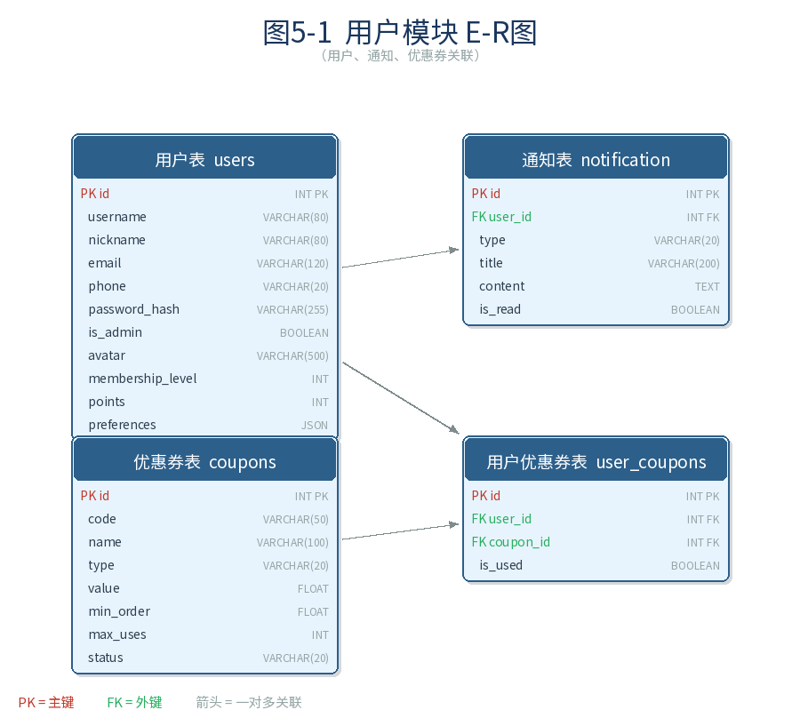
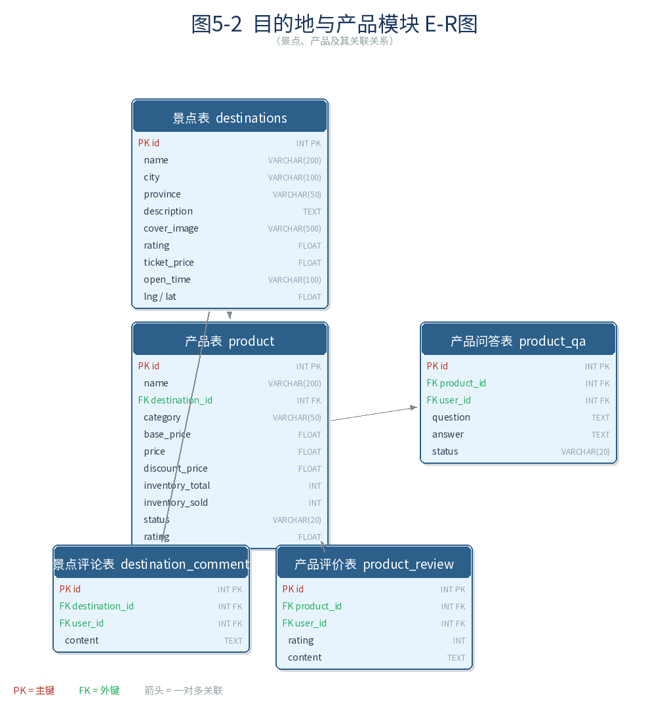
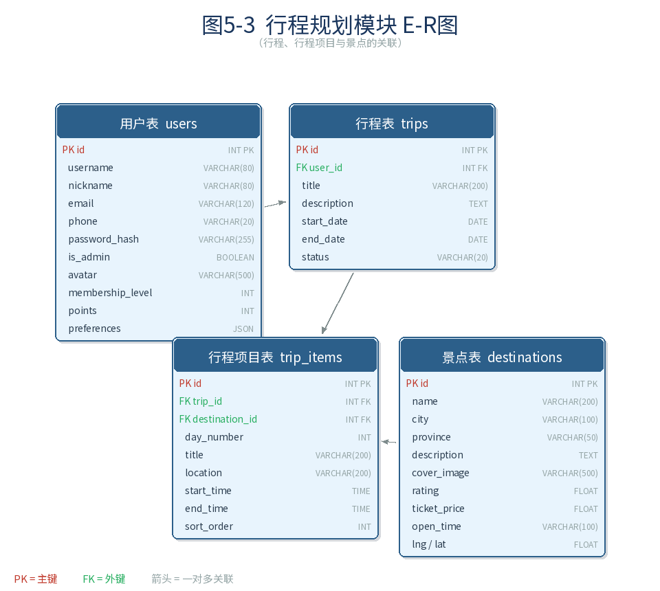
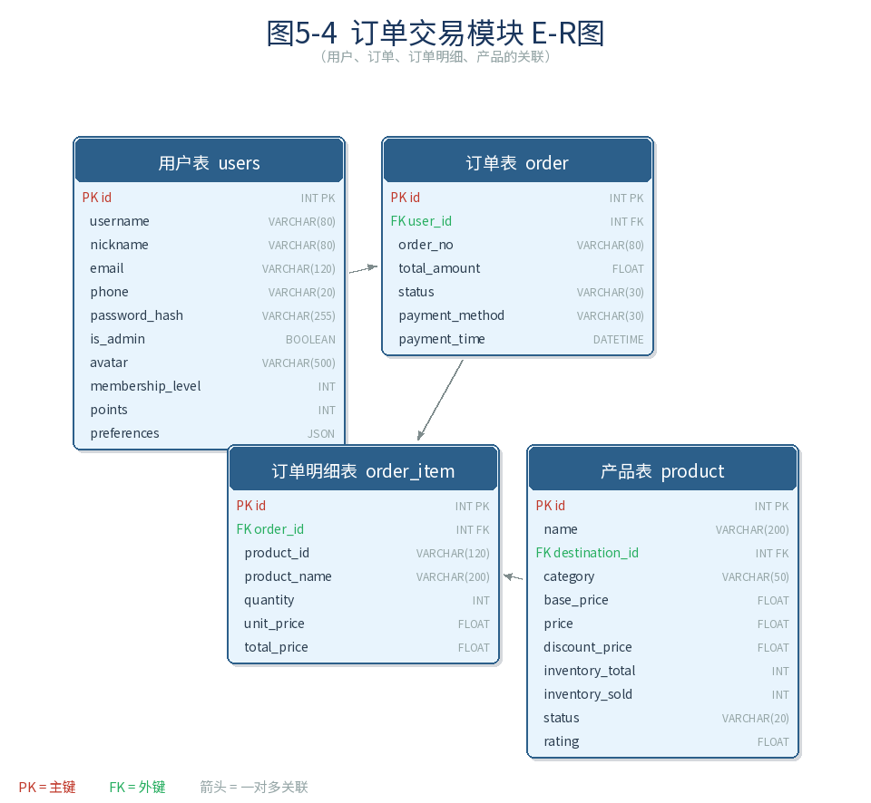
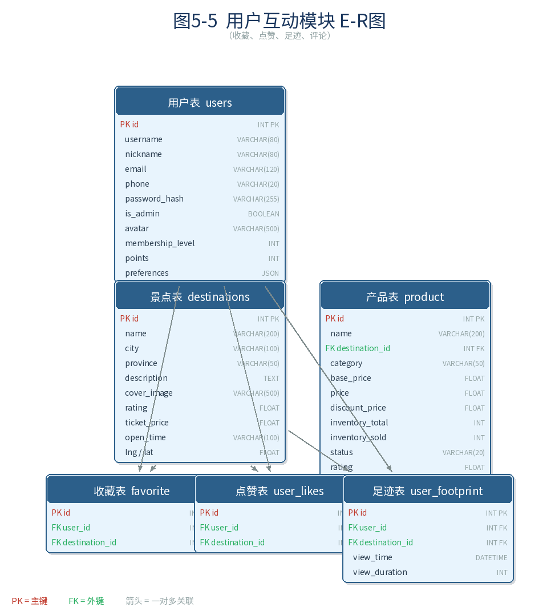
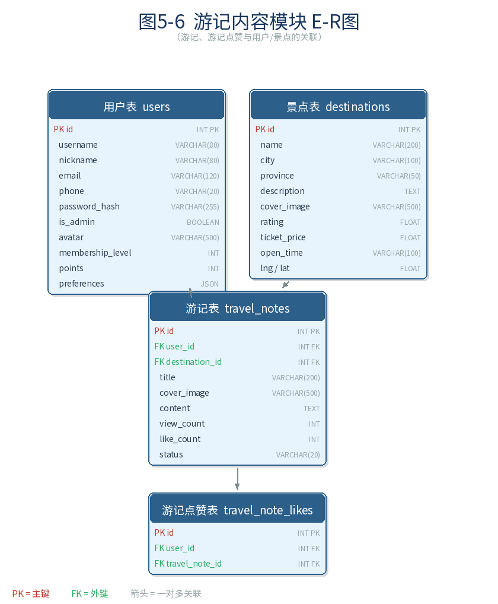
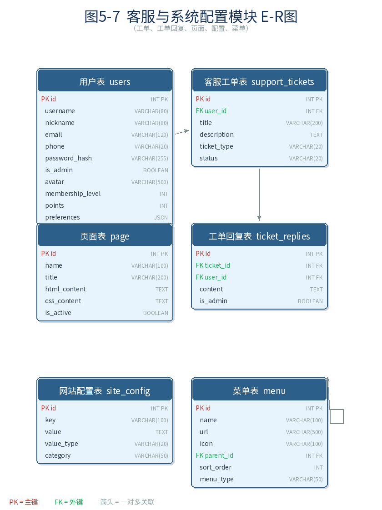

# 第5章 数据库设计

## 5.1 数据库选型

本系统开发阶段使用 SQLite 作为数据库，生产部署时切换为 MySQL 8.0。选用关系型数据库的原因如下：

1. **数据结构明确**：旅游助手的核心数据（用户、景点、订单、行程）都是结构化数据，适合用关系型数据库管理。
2. **事务支持**：订单创建、支付等操作需要保证数据一致性，关系型数据库的 ACID 事务机制可以满足需求。
3. **ORM 兼容**：项目使用 SQLAlchemy ORM 框架，开发时用 SQLite，上线时只需修改一行配置即可切换为 MySQL，代码无需改动。

SQLite 适用于开发和单机部署场景，特点是零配置、文件级存储；MySQL 适用于多用户并发场景，特点是支持高并发读写和更完善的索引机制。SQLAlchemy 抹平了两者在 SQL 语法上的差异，使系统具备良好的数据库可移植性。

## 5.2 概念结构设计（ER 图）

根据系统功能需求，设计了 23 张数据表，涉及用户管理、景点管理、行程管理、订单管理、社交互动、内容管理、系统管理七大模块。按模块拆分的 E-R 图如下：

### 5.2.1 用户模块

用户模块包含用户表（users）、通知表（notification）、优惠券表（coupons）和用户优惠券表（user_coupons）。用户与通知为一对多关系，用户可以收到多条系统通知；优惠券与用户优惠券也为一对多关系，一张优惠券可被多个用户领取。

### 5.2.2 目的地与产品模块

目的地与产品模块包含景点表（destinations）、产品表（product）、景点评论表（destination_comment）、产品评价表（product_review）和产品问答表（product_qa）。一个景点可以有多个产品、多条评论；一个产品可以有多条评价和多个问答。

### 5.2.3 行程规划模块

行程规划模块包含用户表（users）、行程表（trips）、行程项目表（trip_items）和景点表（destinations）。用户创建行程，行程包含多个行程项目，每个项目关联一个景点。

### 5.2.4 订单交易模块

订单交易模块包含用户表（users）、订单表（order）、订单明细表（order_item）和产品表（product）。用户下单后生成订单，订单包含多个明细项，每个明细对应一个产品。

### 5.2.5 用户互动模块

用户互动模块包含收藏表（favorite）、点赞表（user_likes）和足迹表（user_footprint），均与用户表和景点表关联，记录用户对景点的收藏、点赞和浏览行为。

### 5.2.6 游记内容模块

游记内容模块包含游记表（travel_notes）和游记点赞表（travel_note_likes）。用户发布游记，游记关联景点，其他用户可以对游记点赞。

### 5.2.7 客服与系统配置模块

客服与系统配置模块包含客服工单表（support_tickets）、工单回复表（ticket_replies）、页面表（page）、网站配置表（site_config）和菜单表（menu）。用户提交工单，管理员回复；页面、配置和菜单用于后台管理。

### 实体关系说明

| 关系 | 类型 | 说明 |
|------|------|------|
| 用户 → 行程 | 1:N | 一个用户可以创建多个行程 |
| 行程 → 行程项目 | 1:N | 一个行程包含多个行程项目（每日安排） |
| 行程项目 → 景点 | N:1 | 一个行程项目关联一个景点 |
| 用户 → 订单 | 1:N | 一个用户可以有多个订单 |
| 订单 → 订单明细 | 1:N | 一个订单包含多个订单明细项 |
| 订单明细 → 产品 | N:1 | 一个订单明细对应一个产品 |
| 产品 → 景点 | N:1 | 一个产品属于一个景点 |
| 用户 → 景点收藏 | 1:N | 一个用户可以收藏多个景点 |
| 用户 → 景点点赞 | 1:N | 一个用户可以点赞多个景点 |
| 用户 → 浏览足迹 | 1:N | 一个用户产生多条浏览记录 |
| 景点 → 评论 | 1:N | 一个景点可以有多条评论 |
| 用户 → 游记 | 1:N | 一个用户可以发布多篇游记 |
| 游记 → 游记点赞 | 1:N | 一篇游记可以被多个用户点赞 |
| 用户 → 通知 | 1:N | 一个用户可以收到多条通知 |
| 优惠券 → 用户优惠券 | 1:N | 一张优惠券可以被多个用户领取 |
| 工单 → 工单回复 | 1:N | 一个工单可以有多条回复 |

## 5.3 逻辑结构设计（表结构）

### 5.3.1 用户表（users）

用户表存储系统中所有注册用户的基本信息，支持手机号、邮箱、用户名三种登录方式。密码采用 PBKDF2+SHA256 算法进行哈希存储，不保存明文密码。

| 字段名 | 数据类型 | 约束 | 说明 |
|--------|----------|------|------|
| id | Integer | PRIMARY KEY, AUTO_INCREMENT | 用户唯一标识 |
| username | String(80) | UNIQUE, NOT NULL, INDEX | 用户名，用于登录 |
| nickname | String(80) | — | 用户昵称，用于页面展示 |
| email | String(120) | UNIQUE, INDEX | 邮箱地址 |
| phone | String(20) | UNIQUE, INDEX | 手机号码 |
| password_hash | String(255) | — | 密码哈希值（PBKDF2） |
| is_admin | Boolean | DEFAULT FALSE | 是否为管理员 |
| avatar | String(500) | — | 头像图片 URL |
| membership_level | Integer | DEFAULT 1, INDEX | 会员等级（1-普通，2-银卡，3-金卡） |
| points | Integer | DEFAULT 0, INDEX | 用户积分 |
| invite_code | String(20) | UNIQUE, INDEX | 用户自己的邀请码 |
| invited_by | Integer | FOREIGN KEY → users.id, INDEX | 邀请人 ID |
| preferences | JSON | — | 用户偏好设置（JSON 格式） |
| created_at | DateTime | DEFAULT NOW, INDEX | 注册时间 |
| last_login | DateTime | INDEX | 最后登录时间 |

**索引设计**：username、email、phone 三个登录字段均建立唯一索引，保证登录查询效率；membership_level 和 points 建立索引，用于会员筛选和积分排行查询。

### 5.3.2 景点表（destinations）

景点表是系统的核心数据表之一，存储所有景点信息。支持按城市、省份、评分、价格等多维度筛选查询。

| 字段名 | 数据类型 | 约束 | 说明 |
|--------|----------|------|------|
| id | Integer | PRIMARY KEY, AUTO_INCREMENT | 景点唯一标识 |
| name | String(200) | NOT NULL, INDEX | 景点名称 |
| city | String(100) | NOT NULL, INDEX | 所在城市 |
| province | String(50) | NOT NULL, INDEX | 所在省份 |
| description | Text | — | 景点详细描述 |
| cover_image | String(500) | — | 封面图片 URL |
| rating | Float | DEFAULT 5.0, INDEX | 评分（1.0~5.0） |
| ticket_price | Float | DEFAULT 0, INDEX | 门票价格（0 表示免费） |
| open_time | String(100) | — | 开放时间（文本格式） |
| lng | Float | — | 经度，用于地图定位 |
| lat | Float | — | 纬度，用于地图定位 |
| created_at | DateTime | DEFAULT NOW, INDEX | 创建时间 |
| updated_at | DateTime | DEFAULT NOW, INDEX | 更新时间（自动刷新） |

**复合索引**：
- `idx_destination_name_city (name, city)`：优化按名称和城市的组合查询
- `idx_destination_rating_price (rating, ticket_price)`：优化按评分和价格排序的查询

### 5.3.3 行程表（trips）

行程表存储用户创建的旅行计划，与行程项目表（trip_items）构成一对多关系。行程状态包括 planning（规划中）、confirmed（已确认）、completed（已完成）、cancelled（已取消）四种。

| 字段名 | 数据类型 | 约束 | 说明 |
|--------|----------|------|------|
| id | Integer | PRIMARY KEY, AUTO_INCREMENT | 行程唯一标识 |
| user_id | Integer | FOREIGN KEY → users.id, NOT NULL, INDEX | 创建者 ID |
| title | String(200) | NOT NULL | 行程标题 |
| description | Text | — | 行程描述 |
| start_date | Date | INDEX | 开始日期 |
| end_date | Date | INDEX | 结束日期 |
| status | String(20) | DEFAULT 'planning', INDEX | 行程状态 |
| created_at | DateTime | DEFAULT NOW, INDEX | 创建时间 |
| updated_at | DateTime | DEFAULT NOW, INDEX | 更新时间 |

### 5.3.4 行程项目表（trip_items）

行程项目表存储行程中每一天的具体安排，与行程表是多对一关系，与景点表也是多对一关系。通过 day_number 字段区分第几天，sort_order 字段控制同一天内的排序。

| 字段名 | 数据类型 | 约束 | 说明 |
|--------|----------|------|------|
| id | Integer | PRIMARY KEY, AUTO_INCREMENT | 项目唯一标识 |
| trip_id | Integer | FOREIGN KEY → trips.id, NOT NULL, INDEX | 所属行程 ID |
| destination_id | Integer | FOREIGN KEY → destinations.id, INDEX | 关联景点 ID |
| day_number | Integer | NOT NULL, INDEX | 第几天（从 1 开始） |
| title | String(200) | — | 项目标题 |
| description | Text | — | 项目描述 |
| location | String(200) | — | 地点名称 |
| start_time | Time | — | 开始时间 |
| end_time | Time | — | 结束时间 |
| sort_order | Integer | DEFAULT 0 | 排序序号（越小越靠前） |
| created_at | DateTime | DEFAULT NOW, INDEX | 创建时间 |

### 5.3.5 产品表（product）

产品表存储景点门票、体验项目等可购买的产品信息。一个景点可以关联多个产品，产品支持按日期、时间预订。

| 字段名 | 数据类型 | 约束 | 说明 |
|--------|----------|------|------|
| id | Integer | PRIMARY KEY, AUTO_INCREMENT | 产品唯一标识 |
| name | String(200) | NOT NULL | 产品名称 |
| subtitle | String(500) | — | 产品副标题 |
| description | Text | — | 产品详细描述 |
| destination_id | Integer | FOREIGN KEY → destinations.id, INDEX | 关联景点 ID |
| category | String(50) | DEFAULT 'ticket', INDEX | 产品类别（ticket/experience 等） |
| type | String(20) | DEFAULT 'ticket' | 产品类型（与 category 一致） |
| base_price | Float | DEFAULT 0.0 | 基础价格 |
| discount_price | Float | — | 折扣价格 |
| price | Float | DEFAULT 0.0 | 最终售价 |
| location | Text | — | 位置信息（JSON 格式） |
| inventory_total | Integer | DEFAULT 0 | 总库存数量 |
| inventory_sold | Integer | DEFAULT 0 | 已售数量 |
| booking_type | String(20) | DEFAULT 'date' | 预订类型（date/datetime） |
| need_date | Boolean | DEFAULT TRUE | 是否需要选择日期 |
| need_time | Boolean | DEFAULT FALSE | 是否需要选择时间 |
| cover_image | String(500) | — | 封面图片 URL |
| images | Text | — | 图片列表（JSON 格式） |
| status | String(20) | DEFAULT 'active', INDEX | 产品状态（active/inactive/sold_out） |
| rating | Float | DEFAULT 5.0, INDEX | 产品评分 |
| sold_count | Integer | DEFAULT 0, INDEX | 累计销量 |
| created_at | DateTime | DEFAULT NOW, INDEX | 创建时间 |
| updated_at | DateTime | DEFAULT NOW | 更新时间 |

### 5.3.6 订单表（order）

订单表记录用户购买产品的订单信息。订单状态流转：pending（待支付）→ paid（已支付）→ completed（已完成），或者 pending → cancelled（已取消），paid → refunded（已退款）。

| 字段名 | 数据类型 | 约束 | 说明 |
|--------|----------|------|------|
| id | Integer | PRIMARY KEY, AUTO_INCREMENT | 订单唯一标识 |
| user_id | Integer | FOREIGN KEY → users.id, NOT NULL | 下单用户 ID |
| order_no | String(80) | UNIQUE, NOT NULL | 订单编号（系统生成） |
| total_amount | Float | DEFAULT 0.0 | 订单总金额 |
| status | String(30) | DEFAULT 'pending' | 订单状态 |
| payment_method | String(30) | DEFAULT 'alipay' | 支付方式（alipay/wechat） |
| payment_time | DateTime | — | 支付完成时间 |
| created_at | DateTime | DEFAULT NOW | 下单时间 |
| updated_at | DateTime | DEFAULT NOW | 更新时间 |

### 5.3.7 订单明细表（order_item）

订单明细表存储订单中的具体商品项，与订单表是多对一关系。一个订单可以包含多个商品，每个商品记录独立的单价和数量。

| 字段名 | 数据类型 | 约束 | 说明 |
|--------|----------|------|------|
| id | Integer | PRIMARY KEY, AUTO_INCREMENT | 明细唯一标识 |
| order_id | Integer | FOREIGN KEY → order.id, NOT NULL | 所属订单 ID |
| product_id | String(120) | NOT NULL | 产品 ID |
| product_name | String(200) | NOT NULL | 产品名称（冗余存储） |
| product_type | String(50) | NOT NULL | 产品类型 |
| quantity | Integer | DEFAULT 1 | 购买数量 |
| unit_price | Float | DEFAULT 0.0 | 单价 |
| total_price | Float | DEFAULT 0.0 | 小计金额 |
| booking_details | Text | — | 预订详情（JSON 格式） |

**说明**：product_name 和 product_type 采用冗余存储策略，即在下单时将产品信息复制到订单明细中。这样即使产品信息后续修改或下架，历史订单仍然保留完整的商品信息。

### 5.3.8 景点评论表（destination_comment）

| 字段名 | 数据类型 | 约束 | 说明 |
|--------|----------|------|------|
| id | Integer | PRIMARY KEY, AUTO_INCREMENT | 评论唯一标识 |
| destination_id | Integer | FOREIGN KEY → destinations.id, NOT NULL, INDEX | 被评论的景点 ID |
| user_id | Integer | FOREIGN KEY → users.id, NOT NULL, INDEX | 评论者 ID |
| content | Text | NOT NULL | 评论内容 |
| created_at | DateTime | DEFAULT NOW, INDEX | 评论时间 |
| updated_at | DateTime | DEFAULT NOW | 修改时间 |

### 5.3.9 产品评价表（product_review）

| 字段名 | 数据类型 | 约束 | 说明 |
|--------|----------|------|------|
| id | Integer | PRIMARY KEY, AUTO_INCREMENT | 评价唯一标识 |
| product_id | Integer | FOREIGN KEY → product.id, NOT NULL, INDEX | 被评价的产品 ID |
| user_id | Integer | FOREIGN KEY → users.id, NOT NULL, INDEX | 评价者 ID |
| rating | Integer | NOT NULL, DEFAULT 5 | 评分（1~5 分） |
| content | Text | NOT NULL | 评价内容 |
| images | Text | — | 评价图片（JSON 格式，存储 URL 数组） |
| created_at | DateTime | DEFAULT NOW, INDEX | 评价时间 |
| updated_at | DateTime | DEFAULT NOW | 修改时间 |

### 5.3.10 用户收藏表（favorite）

| 字段名 | 数据类型 | 约束 | 说明 |
|--------|----------|------|------|
| id | Integer | PRIMARY KEY, AUTO_INCREMENT | 收藏记录 ID |
| user_id | Integer | FOREIGN KEY → users.id, NOT NULL, INDEX | 用户 ID |
| destination_id | Integer | FOREIGN KEY → destinations.id, NOT NULL, INDEX | 景点 ID |
| created_at | DateTime | DEFAULT NOW, INDEX | 收藏时间 |

### 5.3.11 用户足迹表（user_footprint）

用户足迹表记录用户浏览景点的行为数据，用于实现"最近浏览"功能和个性化推荐的数据支撑。

| 字段名 | 数据类型 | 约束 | 说明 |
|--------|----------|------|------|
| id | Integer | PRIMARY KEY, AUTO_INCREMENT | 足迹记录 ID |
| user_id | Integer | FOREIGN KEY → users.id, NOT NULL, INDEX | 用户 ID |
| destination_id | Integer | FOREIGN KEY → destinations.id, NOT NULL, INDEX | 景点 ID |
| view_time | DateTime | DEFAULT NOW, INDEX | 浏览时间 |
| view_duration | Integer | DEFAULT 0 | 浏览时长（秒） |

### 5.3.12 游记表（travel_notes）

| 字段名 | 数据类型 | 约束 | 说明 |
|--------|----------|------|------|
| id | Integer | PRIMARY KEY, AUTO_INCREMENT | 游记唯一标识 |
| user_id | Integer | FOREIGN KEY → users.id, NOT NULL, INDEX | 作者 ID |
| destination_id | Integer | FOREIGN KEY → destinations.id, INDEX | 关联景点 ID |
| title | String(200) | NOT NULL | 游记标题 |
| cover_image | String(500) | — | 封面图片 URL |
| content | Text | NOT NULL | 游记正文内容 |
| tags | Text | — | 标签（JSON 格式） |
| view_count | Integer | DEFAULT 0 | 浏览次数 |
| like_count | Integer | DEFAULT 0 | 点赞次数 |
| status | String(20) | DEFAULT 'draft' | 状态（draft/published） |
| created_at | DateTime | DEFAULT NOW, INDEX | 发布时间 |
| updated_at | DateTime | DEFAULT NOW | 修改时间 |

### 5.3.13 游记点赞表（travel_note_likes）

| 字段名 | 数据类型 | 约束 | 说明 |
|--------|----------|------|------|
| id | Integer | PRIMARY KEY, AUTO_INCREMENT | 点赞记录 ID |
| user_id | Integer | FOREIGN KEY → users.id, NOT NULL, INDEX | 点赞用户 ID |
| travel_note_id | Integer | FOREIGN KEY → travel_notes.id, NOT NULL, INDEX | 游记 ID |
| created_at | DateTime | DEFAULT NOW | 点赞时间 |

**唯一约束**：`uix_user_note_like (user_id, travel_note_id)`，防止同一用户对同一篇游记重复点赞。

### 5.3.14 通知表（notification）

| 字段名 | 数据类型 | 约束 | 说明 |
|--------|----------|------|------|
| id | Integer | PRIMARY KEY, AUTO_INCREMENT | 通知唯一标识 |
| user_id | Integer | FOREIGN KEY → users.id, NOT NULL, INDEX | 接收用户 ID |
| type | String(20) | DEFAULT 'system', INDEX | 通知类型（system/booking/payment/promotion） |
| title | String(200) | NOT NULL | 通知标题 |
| content | Text | NOT NULL | 通知内容 |
| is_read | Boolean | DEFAULT FALSE, INDEX | 是否已读 |
| read_at | DateTime | — | 阅读时间 |
| created_at | DateTime | DEFAULT NOW, INDEX | 创建时间 |

### 5.3.15 客服工单表（support_tickets）

| 字段名 | 数据类型 | 约束 | 说明 |
|--------|----------|------|------|
| id | Integer | PRIMARY KEY, AUTO_INCREMENT | 工单唯一标识 |
| user_id | Integer | FOREIGN KEY → users.id, NOT NULL, INDEX | 提交用户 ID |
| title | String(200) | NOT NULL | 工单标题 |
| description | Text | NOT NULL | 问题描述 |
| ticket_type | String(20) | DEFAULT 'other' | 工单类型（complaint/suggestion/other） |
| status | String(20) | DEFAULT 'open', INDEX | 工单状态（open/processing/closed） |
| created_at | DateTime | DEFAULT NOW, INDEX | 创建时间 |
| updated_at | DateTime | DEFAULT NOW | 更新时间 |

**工单回复表（ticket_replies）**：

| 字段名 | 数据类型 | 约束 | 说明 |
|--------|----------|------|------|
| id | Integer | PRIMARY KEY, AUTO_INCREMENT | 回复唯一标识 |
| ticket_id | Integer | FOREIGN KEY → support_tickets.id, NOT NULL, INDEX | 所属工单 ID |
| user_id | Integer | FOREIGN KEY → users.id, NOT NULL, INDEX | 回复者 ID |
| content | Text | NOT NULL | 回复内容 |
| is_admin | Boolean | DEFAULT FALSE | 是否为管理员回复 |
| created_at | DateTime | DEFAULT NOW, INDEX | 回复时间 |

## 5.4 数据库优化策略

### 5.4.1 索引优化

系统在设计表结构时，对以下字段建立了索引：

1. **外键字段**：所有外键字段（如 user_id、destination_id、trip_id 等）均建立索引，加速关联查询。
2. **常用查询字段**：name、city、province、rating、status 等经常出现在 WHERE 条件中的字段建立索引。
3. **时间字段**：created_at、updated_at 等时间字段建立索引，支持按时间排序和范围查询。
4. **复合索引**：针对多条件组合查询场景，建立了 name+city、rating+price、user_id+status+created_at 等复合索引。

### 5.4.2 冗余存储

在订单明细表中，product_name 和 product_type 采用冗余存储策略。虽然这违反了数据库范式化原则，但在实际业务中是必要的：产品信息可能被修改或下架，而订单明细需要保留下单时的商品信息。这种"以空间换时间"的策略在电商系统中是常见的设计模式。

### 5.4.3 JSON 字段的使用

系统中多处使用 JSON 类型字段（如 users.preferences、product.images、travel_notes.tags），适用于存储结构不固定或变化频繁的数据。JSON 字段的优势是可以在不修改表结构的情况下扩展数据内容，但也需要注意：频繁的 JSON 字段查询性能不如独立字段，因此仅在数据读取频率低、结构变化频繁的场景下使用。
